<p align="center">
  
</p>

<p align="center">
  <a href="LICENSE"></a>
  <a href="https://github.com/runvendo/vendo/actions/workflows/ci.yml"></a>
  <a href="https://www.npmjs.com/org/vendoai"></a>
</p>

Vendo embeds an agent in your product that lets every customer automate their
work, build their own views, and connect their tools — inside your brand and
your guardrails.

- **Automate work** — customers describe workflows; Vendo runs them through
  your product's own API, as the customer, with approval gates you define.
- **Build views** — the agent composes custom UI from your component catalog
  plus generated React, rendered in an egress-jailed sandbox.
- **Connect tools** — Gmail, Slack, Calendar, any MCP server — wired through
  per-tool consent.

## Quickstart

One command inside a Next.js app:

```bash
npx @vendoai/cli init .
```

Add a provider key to `.env.local` (`ANTHROPIC_API_KEY`, `OPENAI_API_KEY`, or
`GOOGLE_GENERATIVE_AI_API_KEY`), start your dev server, and the Vendo surface
is live in your product. Full walkthrough: [docs/quickstart.md](docs/quickstart.md).

## Packages

| Package | What it is |
|---|---|
| `@vendoai/cli` | `vendo init` — one-command install into a Next.js app |
| `@vendoai/core` | Manifest schemas, GenUI format, the five platform seams |
| `@vendoai/server` | Provider-agnostic agent server (bring any AI SDK provider) |
| `@vendoai/runtime` | Embedded runtime: tools, automations, MCP client |
| `@vendoai/react` | React provider + `useVendoChat` |
| `@vendoai/next` | `createVendoHandler` route handler + `<VendoRoot>` for Next.js |
| `@vendoai/shell` | The embedded surfaces: tabbed page, overlay, slot |
| `@vendoai/components` | Brand-themeable component catalog |
| `@vendoai/stage` | Sandboxed stage runtime and bridge for generated UI |
| `@vendoai/store` | Durable persistence (PGlite default, Postgres in prod) |
| `@vendoai/telemetry` | Anonymous, opt-out build/dev telemetry |

## Demos

- `apps/demo-bank` — **Maple**, a consumer neobank with Vendo embedded
  (`pnpm demo`)
- `apps/demo-accounting` — **Cadence**, an accounting practice app with
  automations + voice (`pnpm demo:accounting`)
- `examples/` — minimal integration examples

## How it works

The agent acts through your product's OpenAPI surface as the signed-in user.
Generated UI renders in a sandboxed iframe with no network egress; host
components render natively from your catalog. Every mutating action flows
through your permission policy — consent prompts, approval tokens, and judged
guardrails. Deeper docs: [docs/](docs/).

## Telemetry

Build/dev tooling collects anonymous, opt-out usage telemetry — no end-user
data, ever. Details and the opt-out switch: [TELEMETRY.md](TELEMETRY.md).

## Contributing

PRs welcome — see [CONTRIBUTING.md](CONTRIBUTING.md). Security reports:
[SECURITY.md](SECURITY.md).

## License

[Apache-2.0](LICENSE)
