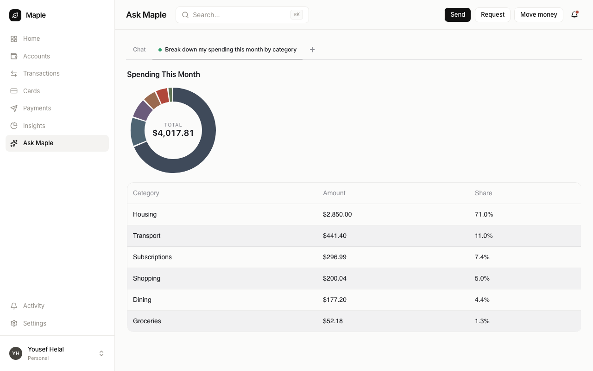

<picture>
  <source media="(prefers-color-scheme: dark)" srcset="assets/banner-dark.svg">
  
</picture>

<p align="center">
  <a href="LICENSE"></a>
  <a href="https://github.com/runvendo/vendo/actions/workflows/ci.yml"></a>
  <a href="https://www.npmjs.com/org/vendoai"></a>
</p>

Vendo embeds an agent in your product that lets every customer automate their
work, build their own views, and connect their tools — inside your brand and
your guardrails.

<p align="center">
  
</p>
<p align="center"><sub>Real capture: a customer of <b>Maple</b> (a demo bank running Vendo) asks a question — the agent
composes a custom view from Maple's own components, through Maple's real API, as that signed-in user.</sub></p>

## Quickstart

One command inside a Next.js app:

```bash
npx @vendoai/cli init .
```

Add a provider key to `.env.local` (`ANTHROPIC_API_KEY`, `OPENAI_API_KEY`, or
`GOOGLE_GENERATIVE_AI_API_KEY`), start your dev server, and the Vendo surface
is live in your product. Full walkthrough: [docs/quickstart.md](docs/quickstart.md).

## Customers reshape your product — you keep the guardrails

### Remix the UI you shipped

Hover any Vendo-wrapped component, describe the change, and it's rebuilt in
place — brand-native, reversible, scoped to that customer.

<p align="center">
  
</p>

### Automate work across their tools

Customers describe workflows in plain language. Vendo turns them into standing
automations that run through your API and their connected tools (Gmail, Slack,
Calendar, any MCP server) — with per-tool consent and approval gates you define.

<p align="center">
  
</p>

## How it works

The agent acts through your product's OpenAPI surface as the signed-in user.
Generated UI renders in a sandboxed iframe with no network egress; host
components render natively from your catalog. Every mutating action flows
through your permission policy — consent prompts, approval tokens, and judged
guardrails. Deeper docs: [docs/](docs/).

## Demos

<p align="center">
  
</p>

- `apps/demo-bank` — **Maple**, a consumer neobank with Vendo embedded
  (`pnpm demo`)
- `apps/demo-accounting` — **Cadence**, an accounting practice app with
  automations, remix, and voice (`pnpm demo:accounting`)
- `examples/` — minimal integration examples

<details>
<summary><b>Packages</b></summary>

| Package | What it is |
|---|---|
| `@vendoai/cli` | `vendo init` — one-command install into a Next.js app |
| `@vendoai/core` | Manifest schemas, GenUI format, the five platform seams |
| `@vendoai/server` | Provider-agnostic agent server (bring any AI SDK provider) |
| `@vendoai/runtime` | Embedded runtime: tools, automations, MCP client |
| `@vendoai/react` | React provider + `useVendoChat` |
| `@vendoai/next` | `createVendoHandler` route handler + `<VendoRoot>` for Next.js |
| `@vendoai/shell` | The embedded surfaces: tabbed page, overlay, slot |
| `@vendoai/components` | Brand-themeable component catalog |
| `@vendoai/stage` | Sandboxed stage runtime and bridge for generated UI |
| `@vendoai/store` | Durable persistence (PGlite default, Postgres in prod) |
| `@vendoai/telemetry` | Anonymous, opt-out build/dev telemetry |

</details>

---

Docs live in [docs/](docs/). Build/dev tooling collects anonymous, opt-out
telemetry — no end-user data, ever ([TELEMETRY.md](TELEMETRY.md)). PRs welcome:
[CONTRIBUTING.md](CONTRIBUTING.md) · security reports: [SECURITY.md](SECURITY.md) ·
[Apache-2.0](LICENSE)
