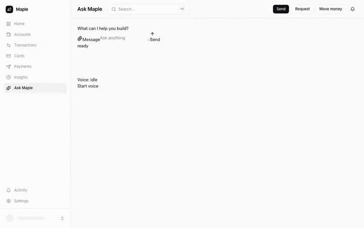

<picture>
  <source media="(prefers-color-scheme: dark)" srcset="assets/banner-dark.svg">
  
</picture>

<p align="center">
  <b>Vendo puts an agent inside your product.</b><br>
  Customers can build views, act through your APIs, and automate work inside your brand and guardrails.
</p>

<p align="center">
  <a href="https://vendo.run">Website</a>
  &nbsp;·&nbsp;
  <a href="https://docs.vendo.run">Docs</a>
  &nbsp;·&nbsp;
  <a href="https://docs.vendo.run/quickstart">Quickstart</a>
</p>

```bash
npm install @vendoai/vendo
npx vendo init
```

`@vendoai/vendo` is the default composition. The `vendoai` package is a thin
alias. Install individual blocks when you want to compose Vendo yourself.

## See it in action

Every capture below is a real agent run in a demo host app, not a mockup. The
stopwatch in each recording is real elapsed time; waits are played back faster.

<table>
  <tr>
    <td width="50%" valign="top">
      
      <p align="center"><sub><b>Build views.</b> Ask a question, get a live view generated from your product's own API data.</sub></p>
    </td>
    <td width="50%" valign="top">
      
      <p align="center"><sub><b>Edit in place.</b> Ask for a change and the view updates without a rebuild, staying visible while it happens.</sub></p>
    </td>
  </tr>
  <tr>
    <td colspan="2" align="center">
      
      <p align="center"><sub><b>Compose your components.</b> Generated views reuse the React components your product registers in the catalog.</sub></p>
    </td>
  </tr>
</table>

## What Vendo does

- Runs a streaming agent with any AI SDK `LanguageModel`.
- Extracts your API as tools and executes present calls with the signed-in user's session.
- Builds user-owned apps from a format-tagged UI document, escalating to a sandboxed server only when needed.
- Applies policy, approvals, grants, breakers, and audit at one execution choke point.
- Runs scheduled, host-event, and external-trigger automations with app-bound grants.
- Ships headless hooks plus optional, theme-driven React chrome.

PGlite at `.vendo/data` is the zero-config store. Production uses the same
schema on Postgres. Generated components run in an iframe jail with
`connect-src 'none'`. App machines reach host tools only through the guarded
tool proxy.

## Packages

| Package | One job |
| --- | --- |
| `@vendoai/core` | Shared types, schemas, formats, validators, and seams |
| `@vendoai/store` | Postgres persistence, with PGlite as the default |
| `@vendoai/agent` | Conversation loop, streaming, tools, and thread context |
| `@vendoai/actions` | Host API and connector tools executed as the signed-in user |
| `@vendoai/guard` | Policy, approvals, grants, audit, breakers, and safety |
| `@vendoai/apps` | App generation, editing, execution, interchange, and sandbox adapters |
| `@vendoai/automations` | Trigger ingestion, schedules, away runs, and run history |
| `@vendoai/ui` | Headless React hooks, optional chrome, tree rendering, and voice surfaces |
| `@vendoai/telemetry` | Anonymous, opt-out build and development telemetry |
| `@vendoai/vendo` | Default composition, public wire, React entry, and `vendo` bin |

## Install flow

`vendo init` scans the host app, then asks about the model import, product brief,
critical-tool risk labels, and whether to open the MCP door. It proposes the
handler route and `<VendoRoot>` wiring while extracting the theme automatically.
Every code change is permission-gated and shown as a diff. It writes the
reviewable `.vendo/` directory and leaves the PGlite data directory ignored.

Run `vendo doctor` to check wiring and probe `/status`. Run `vendo sync` in
build and development flows to refresh extracted tools and remix baselines.

Read the [quickstart](https://docs.vendo.run/quickstart) for the complete
composition and first-turn setup.

## License

Apache-2.0. Cloud-gated sharing, publishing, org overlays, and pinning activate
with `VENDO_API_KEY`; the open-source blocks remain self-hosted.
