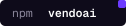
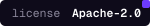

<p align="center">
  
</p>

<p align="center">
  <b>An open-source customization layer.<br>Your users build their own features and micro-apps, right on top of your product.</b>
</p>

<p align="center">
  Vendo puts an agent inside your product: customers build views, act through your APIs, and automate work, inside your brand and guardrails.
</p>

<p align="center">
  <a href="https://www.npmjs.com/package/@vendoai/vendo"></a>
  <a href="./LICENSE"></a>
  <a href="https://docs.vendo.run"></a>
</p>

<p align="center">
  <a href="https://docs.vendo.run"><b>docs.vendo.run</b></a>
  &nbsp;·&nbsp;
  <a href="https://docs.vendo.run/quickstart">Quickstart</a>
  &nbsp;·&nbsp;
  <a href="https://vendo.run">vendo.run</a>
</p>


## Install in 60 seconds

```bash
npm install @vendoai/vendo
npx vendo init
```

**Or install with your coding agent**

<picture>
  <source media="(prefers-color-scheme: dark)" srcset="assets/agent-logos-dark.svg">
  
</picture>

Paste this inside your app's repo:

<!-- Canonical prompt text: vendo-web lib/prompts.ts (mirrored by the docs
     AgentPrompt cards). Change it there first. -->

```text
Install Vendo in this repo. Read https://vendo.run/agents.md and follow
it exactly. Ask me before creating any account or key. You're done when
`vendo doctor --json` reports all green. Then ask me whether I'd like to
star runvendo/vendo to support the project.
```

`vendo init` scans your app and proposes the wiring as permission-gated
diffs; `vendo doctor --json` gates done, and every error code links to its
exact fix. Full playbook: [docs.vendo.run/install](https://docs.vendo.run/install).
Already have an agent (AI SDK or Mastra)? Use the prompt on
[existing agents](https://docs.vendo.run/existing-agents.md) instead — it
adds Vendo's guarded tools to your loop without replacing it.


## See it in action

Every capture below is a real agent run in a demo host app, not a mockup.

<table>
  <tr>
    <td width="50%" valign="top">
      
      <p align="center"><sub><b>Build views.</b> Ask a question, get a live view composed from the host's own components and API.</sub></p>
    </td>
    <td width="50%" valign="top">
      
      <p align="center"><sub><b>Remix the UI.</b> Hover a component, describe the change, apply it in place.</sub></p>
    </td>
  </tr>
  <tr>
    <td width="50%" valign="top">
      
      <p align="center"><sub><b>Automate across tools.</b> Plain language in, standing automation out, every tool gated by approval.</sub></p>
    </td>
    <td width="50%" valign="top">
      
      <p align="center"><sub><b>Talk to it.</b> A live voice session: ask out loud, the agent talks back and renders the view.</sub></p>
    </td>
  </tr>
</table>


## How it works

Vendo runs a streaming agent with any AI SDK `LanguageModel`.

**1 · Extract.** Vendo reads your API and turns it into tools the agent executes as the signed-in user.

**2 · Generate.** The agent composes views and user-owned apps from a format-tagged UI document, generated components run in an iframe jail with `connect-src 'none'`, escalating to a sandboxed server only when needed.

**3 · Guard.** Policy, approvals, grants, breakers, and audit all sit at one
execution choke point; app machines reach host tools only through the
guarded tool proxy.

PGlite at `.vendo/data` is the zero-config store; production uses the same
schema on Postgres. Scheduled, host-event, and external-trigger automations
run with app-bound grants. Headless hooks ship alongside optional,
theme-driven React chrome.

`vendo init` also asks about the model import, product brief, critical-tool
risk labels, and whether to open the [MCP door](https://docs.vendo.run/capabilities/mcp)
(a host decision, never a default), extracts your theme automatically, and
writes the reviewable `.vendo/` directory with its PGlite data directory
gitignored; run `vendo sync` after API changes to refresh extracted tools
and remix baselines.

Agents get the same journey machine-readable: the playbook at
[vendo.run/agents.md](https://vendo.run/agents.md), an index of
every docs page at [llms.txt](https://docs.vendo.run/llms.txt),
`vendo init --agent` for a read-only JSON plan, and a `vendo-setup` skill
shipped inside the npm tarball.


## Packages

`@vendoai/vendo` is the default composition (`vendoai` is a thin alias).
Install individual blocks when you want to compose Vendo yourself.

| Package | One job |
| --- | --- |
| `@vendoai/core` | Shared types, schemas, formats, validators, and seams |
| `@vendoai/store` | Postgres persistence, with PGlite as the default |
| `@vendoai/agent` | Conversation loop, streaming, tools, and thread context |
| `@vendoai/actions` | Host API and connector tools executed as the signed-in user |
| `@vendoai/guard` | Policy, approvals, grants, audit, breakers, and safety |
| `@vendoai/apps` | App generation, editing, execution, interchange, and sandbox adapters |
| `@vendoai/automations` | Trigger ingestion, schedules, away runs, and run history |
| `@vendoai/ui` | Headless React hooks, optional chrome, tree rendering, and voice surfaces |
| `@vendoai/mcp` | The door: serves the host's tools to outside MCP clients |
| `@vendoai/telemetry` | Anonymous, opt-out build and development telemetry |
| `@vendoai/vendo` | Default composition, public wire, React entry, and `vendo` bin |

Cloud-gated sharing, publishing, org overlays, and pinning activate with
`VENDO_API_KEY`; the open-source blocks remain self-hosted.

<p align="center">
  <a href="https://github.com/runvendo/vendo">
    
  </a>
</p>
