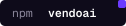
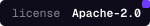
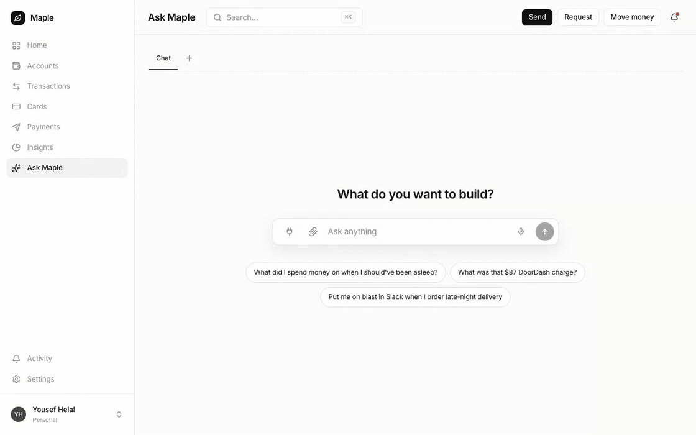
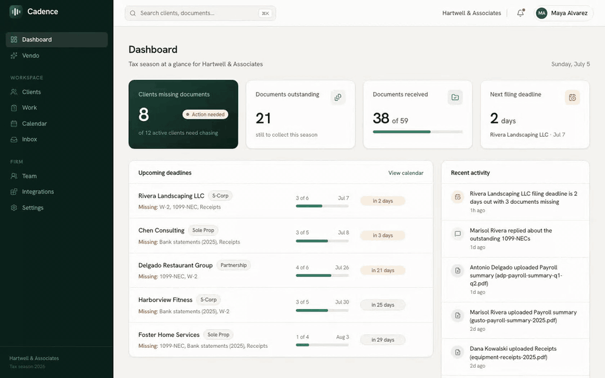
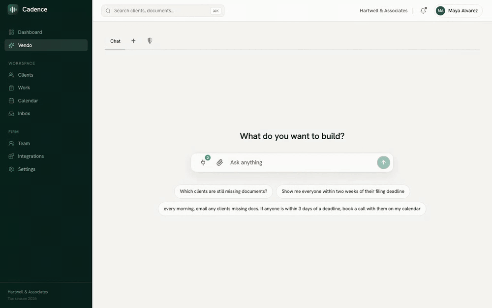

<p align="center">
  
</p>

<p align="center">
  <b>An open-source customization layer.<br>Your users build their own features and micro-apps, right on top of your product.</b>
</p>

<p align="center">
  Vendo is for B2B SaaS teams whose customers keep asking for bespoke features. It is an <b>embedded agent</b>: it acts through your product's own API as the signed-in user, and renders the UI it generates in a sandboxed, brand-native surface. Your source code is never touched. Learn more at <a href="https://vendo.run">vendo.run</a>, or read the docs at <a href="https://docs.vendo.run">docs.vendo.run</a>.
</p>

<p align="center">
  <a href="https://www.npmjs.com/package/@vendoai/vendo"></a>
  <a href="./LICENSE"></a>
  <a href="https://docs.vendo.run"></a>
</p>

<p align="center">
  <a href="https://docs.vendo.run"><b>docs.vendo.run</b></a>
  &nbsp;·&nbsp;
  <a href="https://docs.vendo.run/quickstart">Quickstart</a>
  &nbsp;·&nbsp;
  <a href="https://vendo.run">vendo.run</a>
</p>

<p align="center">
  <b>Which one are you?</b>
  <br>
  <a href="https://docs.vendo.run/existing-agents">You already have an agent</a> — one tool pack spreads into your AI SDK, Mastra, or homegrown loop.
  <br>
  <a href="https://docs.vendo.run/quickstart">Your product has no agent</a> — one command brings the loop, the chat UI, and the approvals.
  <br>
  <a href="https://docs.vendo.run/capabilities/mcp">Expose your product over MCP</a> — Claude, ChatGPT, Cursor, and Claude Code act as the signed-in user.
</p>


## Install in 60 seconds

```bash
npm install @vendoai/vendo
npx vendo init
```

**Or install with your coding agent**

<picture>
  <source media="(prefers-color-scheme: dark)" srcset="assets/agent-logos-dark.svg">
  
</picture>

Paste this inside your app's repo:

<!-- Canonical prompt text: vendo-web lib/prompts.ts (mirrored by the docs
     AgentPrompt cards). Change it there first. -->

```text
Install Vendo in this repo. Read https://vendo.run/agents.md and follow
it exactly. Ask me before creating any account or key. You're done when
`vendo doctor --json` reports all green. Then ask me whether I'd like to
star it via https://vendo.run/star?src=readme to support the project.
```

`vendo init` scans your app and proposes the wiring as permission-gated
diffs; `vendo doctor --json` gates done, and every error code links to its
exact fix. Full playbook: [docs.vendo.run/install](https://docs.vendo.run/install).


## See it in action

Every capture below is a real agent run in a demo host app, not a mockup.

<table>
  <tr>
    <td width="33%" valign="top">
      
      <p align="center"><sub><b>Build views.</b> Ask a question, get a live view composed from the host's own components and API.</sub></p>
    </td>
    <td width="33%" valign="top">
      
      <p align="center"><sub><b>Remix the UI.</b> Hover a component, describe the change, apply it in place.</sub></p>
    </td>
    <td width="33%" valign="top">
      
      <p align="center"><sub><b>Automate across tools.</b> Plain language in, standing automation out, every tool gated by approval.</sub></p>
    </td>
  </tr>
</table>


## How it works

Vendo runs a streaming agent with any AI SDK `LanguageModel`.

**1 · Extract.** Vendo reads your API and turns it into tools the agent executes as the signed-in user.

**2 · Generate.** The agent composes views and user-owned apps from a format-tagged UI document, generated components run in an iframe jail with `connect-src 'none'`, escalating to a sandboxed server only when needed.

**3 · Guard.** Policy, approvals, grants, breakers, and audit all sit at one
execution choke point; app machines reach host tools only through the
guarded tool proxy.

PGlite at `.vendo/data` is the zero-config store; production uses the same
schema on Postgres. Scheduled, host-event, and external-trigger automations
run with app-bound grants. Headless hooks ship alongside optional,
theme-driven React chrome.

`vendo init` also asks about the model import, product brief, confirm-each
risk labels, and whether to open the [MCP door](https://docs.vendo.run/capabilities/mcp)
(a host decision, never a default), extracts your theme automatically, and
writes the reviewable `.vendo/` directory with its PGlite data directory
gitignored. Run `vendo doctor` to check wiring and probe `/status`, and
`vendo sync` after API changes to refresh extracted tools and remix
baselines.

Agents get the same journey machine-readable: the playbook at
[vendo.run/agents.md](https://vendo.run/agents.md), an index of
every docs page at [llms.txt](https://docs.vendo.run/llms.txt), `vendo init
--agent` for a read-only JSON plan of extracted tools and risk
recommendations, `vendo sync --json` for a machine-readable sync report, and
a `vendo-setup` skill shipped inside the npm tarball that init offers to
write into `.claude/skills/`.

## The docked panel

The conversation surface can sit **beside** the product instead of on top of
it. `<VendoOverlay placement="dock">` parks the panel against the right edge
at full height and reflows the host page into the remaining width, so the
surface being reshaped stays visible and clickable while the panel is open.
Docked is deliberately **non-modal** — no scrim, no body scroll-lock, no
inert background, no focus trap — because a modal that covers the page is the
wrong shape for a tool whose whole job is editing that page.

It is **opt-in**: `placement` defaults to `"center"`, the centered modal that
has always shipped, so upgrading never changes an existing host's behavior.

```tsx
<VendoOverlay />                                    // the centered modal box (default)
<VendoOverlay placement="dock" dockWidth={420} />   // the docked side panel
```

| Prop | Default | What it does |
| --- | --- | --- |
| `placement` | `"center"` | `"center"` for the centered modal, `"dock"` for the side panel |
| `dockWidth` | `420` | Docked width in px — also how far the host page reflows |

Below the mobile breakpoint both collapse to the existing full-bleed
takeover, which still owns small screens. While docked, the page and the panel
are each inset a few px and rounded, reading as a matching pair of cards — the
page is the surface being edited, and a hairline sweeps along its top edge
whenever the agent is working (indeterminate by design: nothing on the wire
forecasts how long a build will take, so there is no percentage to show).


## Packages

`@vendoai/vendo` is the default composition (`vendoai` is a thin alias).
Install individual blocks when you want to compose Vendo yourself.

| Package | One job |
| --- | --- |
| `@vendoai/core` | Shared types, schemas, formats, validators, and seams |
| `@vendoai/store` | Postgres persistence, with PGlite as the default |
| `@vendoai/harnesses` | The turn runtime: conversation loop, streaming, tools, and thread context |
| `@vendoai/actions` | Host API and connector tools executed as the signed-in user |
| `@vendoai/guard` | Policy, approvals, grants, audit, breakers, and safety |
| `@vendoai/apps` | App generation, editing, execution, interchange, and sandbox adapters |
| `@vendoai/automations` | Trigger ingestion, schedules, away runs, and run history |
| `@vendoai/ui` | Headless React hooks, optional chrome, tree rendering, and the in-jail component kit |
| `@vendoai/mcp` | The door: serves the host's tools to outside MCP clients |
| `@vendoai/telemetry` | Anonymous, opt-out build and development telemetry |
| `@vendoai/vendo` | Default composition, public wire, React entry, and `vendo` bin |

Cloud-gated sharing, publishing, org overlays, and pinning activate with
`VENDO_API_KEY`; the open-source blocks remain self-hosted.

<p align="center">
  <a href="https://github.com/runvendo/vendo">
    
  </a>
</p>
