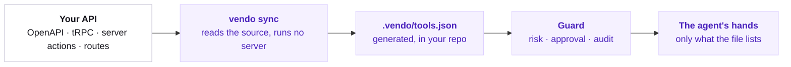

## The pipeline

Four extractors read what you already wrote. One file is the result.



Only tools in that file exist. Nothing else reaches your API.

<Note>
  **Fails closed.** A route the extractor cannot classify is written `disabled`, with a note saying why. Enable it deliberately after you read it.
</Note>

Extraction runs in a fixed order: OpenAPI, tRPC, Next.js server actions, then the route scan. Each one skips itself when your app has nothing for it.

## One tool, honestly

Every entry carries the same five fields. Here is one, whole.

```json .vendo/tools.json highlight={3,9,10-14}
{
  "name": "host_deleteTask",
  "description": "Permanently delete a Relay task",
  "inputSchema": {
    "type": "object",
    "properties": { "id": { "type": "string" } },
    "required": ["id"]
  },
  "risk": "destructive",
  "binding": {
    "kind": "openapi",
    "operationId": "deleteTask",
    "method": "DELETE",
    "path": "/api/tasks/{id}"
  }
}
```

- `description` is written for the model: what the tool does for the user, not a restatement of the path.
- `risk` is what the guard reads before the call. `destructive` asks first.
- `binding` is where the call lands. The runtime executes from it without re-reading your spec.

### Where the grade comes from

Extraction grades from protocol facts only. `DELETE` is `destructive` and a tRPC mutation is at least `write`; a name decides nothing.

Everything else lands `ungraded`, which the guard asks about on every call. The grading pass reads the handler behind each tool and writes what it finds to `.vendo/judgments.json`, running on your Cloud key.

<Warning>
  Never hand-edit `.vendo/tools.json`. The next sync regenerates it wholesale.
</Warning>

## Keeping it current

The tool surface is a build artifact, so it moves when your API moves.

<Steps>
  <Step title="Edit your API">
    Add the route, the procedure, or the action. Nothing about it is Vendo-shaped.
  </Step>
  <Step title="Run npx vendo sync">
    The extractors re-read your source. No server starts.
  </Step>
  <Step title="Read the diff in git">
    `.vendo/tools.json` is a tracked file, so a new capability arrives as a reviewable change.
  </Step>
</Steps>

`vendo init` hooks sync into `predev` and `prebuild` in your `package.json`, so step 2 also runs on its own.

## Overrides

Corrections live in their own file, which sync never touches.

```json .vendo/overrides.json focus={4-5}
{
  "format": "vendo/overrides@3",
  "tools": {
    "host_invoices_delete": { "risk": "destructive", "confirmEach": true },
    "host_internal_debug": { "disabled": true }
  }
}
```

Overrides win field by field: re-grade a tool, make it confirm every run, or hide it entirely. They are the last word, applied after both extraction and the grading pass.

Raising risk lapses old grants. The next call parks a fresh approval that names the invalidated grant, and audits one `grant-invalidated` decision.

### Compound tools

The same file's `compounds` array bundles a short sequence of existing tools into one capability the agent calls by name.

Each step still crosses the guard on its own descriptor, so approvals, grants, and audit apply per step. A compound entry inside `tools.json` is rejected.

## Where to go next

Your API is one source of tools. Two more sit beside it.

<CardGroup cols={3}>
  <Card title="Connected accounts" href="/capabilities/connected-accounts">
    Each user connects their own Gmail, Slack, or GitHub once.

    Connected accounts →
  </Card>
  <Card title="Automations" href="/capabilities/automations">
    The same tools, fired on a schedule or by an event.

    Automations →
  </Card>
  <Card title="Guard" href="/how-vendo-works">
    Risk grade, approval, and an audit line on every call.

    How Vendo works →
  </Card>
</CardGroup>
