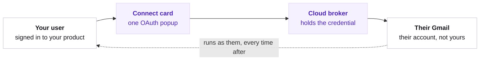

## The picture

No user token enters your server. The broker holds the credential and runs the call.



A connection is keyed to the Vendo principal's subject. One user can never read, use, or disconnect another user's account.

## Naming the services

With a Cloud key and nothing else, the agent gets one tool that lists what this product can connect to, and one that asks the user to connect it. No service tools sit on the listing.

Name toolkits when you want their tools in the agent's hands from the start.

```ts app/api/vendo/[...vendo]/route.ts focus={4}
const vendo = createVendo({
  principal: resolvePrincipal,
  instructions: "...",
  connectors: ["gmail", "slack"],
});
```

Those strings scope three things at once: the tools the agent sees, the accounts the connect surface offers, and the catalog it advertises. They can never drift apart.

<Note>
  The same list also accepts a connector object, which is used verbatim. Strings are the Cloud path.
</Note>

## The connect card

A tool call for a service the user has not connected never reaches the guard. The call comes back `connect-required`, and the thread renders the ask in place.

<Steps>
  <Step title="The user selects Connect">
    A popup opens on the broker's own consent page. Your product never renders an OAuth screen.
  </Step>
  <Step title="The card polls until the account is active">
    The user finishes in the popup and it closes itself.
  </Step>
  <Step title="The thread retries the original call">
    No re-prompting. The turn picks up where it stopped.
  </Step>
</Steps>

<Frame caption="The ask arrives as a card in the thread, where the user already is.">
  
</Frame>

The agent can also raise the ask on its own before calling anything, when the request plainly needs a service the user has not connected.

## Managing accounts

The `useConnections` hook reads the signed-in user's accounts and disconnects them. Render it wherever you already handle user settings.

```tsx
const { connections, disconnect, isLoading } = useConnections();
```

The shipped thread also carries a connect dock: a badge counting active accounts, and a tray listing everything connectable.

<Frame caption="The dock is the standing surface. The card is the moment.">
  
</Frame>

Every route below uses exactly the resolved principal's subject. There is no caller-supplied subject and no cross-user read.

| Route | Method | Purpose |
| --- | --- | --- |
| `/api/vendo/connections` | GET | list the caller's connected accounts |
| `/api/vendo/connections/initiate` | POST | `{ toolkit }` back to `{ id, connector, redirectUrl }` |
| `/api/vendo/connections/catalog` | GET | what this deployment can connect to |
| `/api/vendo/connections/:id` | GET | status; poll while connecting |
| `/api/vendo/connections/:id` | DELETE | disconnect |

Connecting needs a signed-in person. A principal marked `ephemeral`, or one under a reserved synthetic subject, is refused: an external account would outlive it.

## What the guard sees

A connector tool's risk comes from the provider's own tags and nothing else. `destructiveHint` grades it destructive, `readOnlyHint` grades it read, and an untagged tool is `ungraded`, which the guard asks about on every call.

`.vendo/overrides.json` still wins, so you can pin the grade of any tool by name.

Every connector call is audited with the account identity behind it: the connector, the toolkit, and the subject it ran as. That identity is stripped from the outcome the model and the UI see.

## Where to go next

Outside services are one source of tools. Two more sit beside them.

<CardGroup cols={3}>
  <Card title="API tools" href="/capabilities/api-tools">
    Your own routes, extracted into a guarded tool set.

    API tools →
  </Card>
  <Card title="Automations" href="/capabilities/automations">
    The same tools, fired on a schedule or by an event.

    Automations →
  </Card>
  <Card title="Guard" href="/how-vendo-works">
    Risk grade, approval, and an audit line on every call.

    How Vendo works →
  </Card>
</CardGroup>
