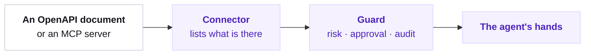

## Where tools come from

`vendo sync` reads **your** API. A connector reads someone else's, at boot, and hands the result to the same registry.



Connector tools are ordinary tools. They collide-check against your own by name, they take corrections in `.vendo/overrides.json`, and every call goes through the guard.

<Note>
  For per-user OAuth into Gmail, Slack, or GitHub, use [connected accounts](/capabilities/connected-accounts) instead. Connectors here carry one credential you control, not one per user.
</Note>

## Any REST API with a spec

`openApiConnector` takes the spec **document**, not a path or a URL — read it, bundle it, or fetch it yourself, then hand it over.

```ts app/api/vendo/[...vendo]/route.ts focus={6,7,8,9,10,11}
import { readFileSync } from "node:fs";
import { createVendo, openApiConnector } from "@vendoai/vendo/server";

const vendo = createVendo({
  connectors: [
    openApiConnector({
      name: "ledger",
      spec: readFileSync("./specs/ledger.json", "utf8"),
      baseUrl: "https://api.ledger.example",
      headers: { authorization: `Bearer ${process.env.LEDGER_TOKEN}` },
    }),
  ],
});
```

| Option | What it does |
| --- | --- |
| `spec` | The document itself: JSON text, YAML text, or an already-parsed object. |
| `baseUrl` | Where the calls land. Wins over the spec's own `servers[0]`. |
| `headers` | Static headers, or a function called per tool call (below). |
| `name` | The namespace every tool is named under. Defaults to `openapi`. |

Each operation becomes one tool named `openapi_<name>_<operationId>` — `openapi_ledger_getAccount`. Path parameters, query parameters, and the JSON request body come straight off the spec, so the model sees the API's own declared shape.

Risk comes from the method, never the name: `DELETE` is `destructive`, everything else is `ungraded` until you grade it. An ungraded call is one the guard asks about.

```json .vendo/overrides.json
{
  "format": "vendo/overrides@3",
  "tools": {
    "openapi_ledger_getAccount": { "risk": "read" },
    "openapi_ledger_createAccount": { "risk": "write" }
  }
}
```

<Note>
  This is the same extractor `vendo sync` runs over a spec in your repo, and the same HTTP dispatch your own tools execute through. A spec behaves identically whichever door it comes in.
</Note>

## An MCP server

`mcpConnector` speaks streamable HTTP to any MCP server and lists its tools at boot.

```ts app/api/vendo/[...vendo]/route.ts focus={5,6,7,8,9}
import { createVendo, mcpConnector } from "@vendoai/vendo/server";

const vendo = createVendo({
  connectors: [
    mcpConnector({
      name: "linear",
      url: "https://mcp.linear.app/mcp",
      headers: { authorization: `Bearer ${process.env.LINEAR_TOKEN}` },
    }),
  ],
});
```

Tools are named `mcp_<name>_<tool>`. Risk is read off the server's own annotations: `destructiveHint` is `destructive`, `readOnlyHint` is `read`, and anything else is `write`.

## One credential per user

Pass a function instead of an object and it runs on every call, with the acting principal in hand. Both connectors take the same shape.

```ts focus={5,6,7}
openApiConnector({
  name: "ledger",
  spec,
  baseUrl: "https://api.ledger.example",
  headers: async ({ principal }) => ({
    authorization: `Bearer ${await tokenFor(principal?.subject)}`,
  }),
});
```

The resolver receives `principal`, `presence` (`present` or `away`), and `grant` when the guard decided the call against a standing permission.

<Warning>
  Hand back a service-level credential when `principal` is undefined, never a specific user's. That case is real: `mcpConnector` also resolves headers when it **lists** the server's tools, a system operation with no principal. `openApiConnector` reads its listing straight off the document, so it only resolves headers for real calls.
</Warning>

An MCP connector with a resolver also keeps one protocol session per subject, so a server that binds auth to the session can never mix two users up.

## Which layer holds the credential

Three separate things can put a credential on a call, and two of them are this page.

| Layer | Who sets it up | Whose credential runs the call |
| --- | --- | --- |
| A connector's static `headers` | You, once, at boot | Yours — the whole deployment shares it |
| A connector's [headers resolver](#one-credential-per-user) | You, once, at boot | Whatever you hand back for that principal |
| [Connected accounts](/capabilities/connected-accounts) | Each user, through one OAuth popup | Theirs — the broker holds it and runs the call |

The resolver is the per-user path for the connectors on this page: `openApiConnector` and `mcpConnector` both take one, it runs on every call with the acting principal in hand, and what it returns is that call's headers. So a host can send a different token for every user without a broker in the way.

<Warning>
  **[Tenant connectors](/capabilities/tenant-connectors) have no per-user path in this release.** The token an org pastes at registration is vaulted once for that org and rides static headers, so every member of that org calls with the same credential. The resolver above is not reachable from a tenant registration.
</Warning>
