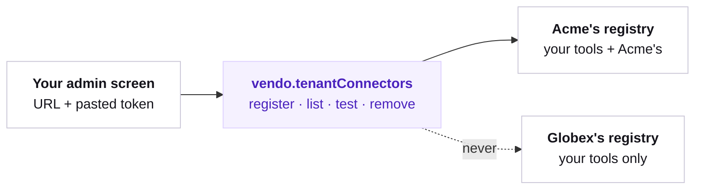

## The picture

Acme pastes an MCP URL and a token into your admin screen. From the next request, Acme's users have Acme's tools. Globex's users never see them — not because a filter hid them, but because Globex is served a different tool registry.



There is no Vendo-hosted UI here. The API is server-side, and the screen around it is yours.

## Registering

`register` is save-and-test in one call: it validates by actually connecting, and answers with the tools the server really advertised.

```ts
const result = await vendo.tenantConnectors.register({
  org: "acme",
  name: "billing",
  kind: "mcp",
  url: "https://mcp.acme.example/sse",
  token: pastedToken,
});

if (result.status === "ok") {
  console.log(result.tools.map((tool) => tool.name)); // ["mcp_billing_lookup_invoice"]
}
```

A refusal is typed, never a thrown string:

```ts
if (result.status === "error") {
  // result.error.code — "unavailable" when the server did not answer,
  // "validation" when the registration was not usable.
  showToUser(result.error.message);
}
```

An OpenAPI tenant passes a spec instead of an MCP URL. `url` then names the API's base URL.

```ts
await vendo.tenantConnectors.register({
  org: "acme",
  name: "crm",
  kind: "openapi",
  spec: pastedYaml,
  url: "https://api.acme.example",
  token: pastedToken,
});
```

## Who sees what

Visibility follows the orgs your host asserts for the request — the same `memberships` seam the rest of Vendo reads. A run that asserts `acme` is served a registry carrying your tools plus Acme's; a run that asserts nothing is served the shared registry, unchanged.

The isolation is structural. Another tenant's connector is not withheld from that registry, it was never in it — so there is no filter that can be got wrong, and no listing that can leak a name.

<Note>
  Without a memberships seam no request can name an org, so nothing here can ever
  bind. The boot block says so: the `tenants` row appears only once the seam is wired.
</Note>

## The token

The pasted token is vaulted in your store's encrypted secrets under a tenant-scoped name, and it is never readable back on any surface. `list` answers metadata only.

```ts
await vendo.tenantConnectors.list("acme");
// [{ org: "acme", name: "billing", kind: "mcp", url: "…", registeredAt: "…" }]
```

The vault belongs to whichever store composes. If Vendo composes it, `VENDO_STORE_ENCRYPTION_KEY` (base64, 32 bytes) is what turns it on. If you pass your own store, you configure it there yourself — `createStore({ url, encryption: { key: ... } })` — because an explicitly passed store owns its own secrets config, and the environment variable never reaches it.

Without one of those two, a registration carrying a token is refused in every environment, not just production. A tokenless registration is unaffected: it stores no secret, so it needs no vault.

## Checking and removing

`test` re-runs the same live handshake `register` did, which is what an admin screen's status dot should call.

```ts
const status = await vendo.tenantConnectors.test("acme", "billing");
```

`remove` drops the registration and its vaulted token, and the tools are gone from the next request onward.

```ts
await vendo.tenantConnectors.remove("acme", "billing");
```

Registrations are stamped with the org that owns them, so erasing that org through the [store's erase API](/production/persistence) takes them with it.

## What this is not

<Columns cols={2}>
  <Card title="Not per-user credentials">
    One token per tenant, shared by that tenant's users. For a credential per
    person, use [connected accounts](/capabilities/connected-accounts).
  </Card>
  <Card title="Not an OAuth flow">
    A pasted token, not a consent screen against the tenant's server.
  </Card>
</Columns>
