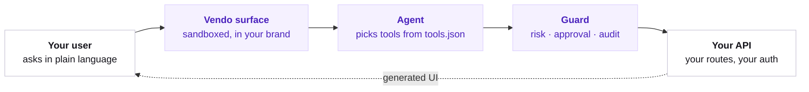

## The picture

Every request walks the same five boxes, in the same order.



Three boxes are Vendo. The two on the ends are yours.

<Note>
  Vendo Cloud runs the managed pieces behind those boxes: the hosted store, model gateway, sandbox, and broker.
</Note>

## One request, end to end

The same path, with one real turn moving through it.

## What runs where

Your repo, your API, and your auth stay on your side. Vendo Cloud runs the managed pieces.

<Columns cols={2}>
  <Card title="Your machine, your infra" icon="folder">
    Never leaves your side.

    - your repo and code
    - `.vendo/`
    - your API and routes
    - your auth
  </Card>
  <Card title="Vendo Cloud" icon="cloud">
    The pieces Vendo runs for you.

    - hosted store
    - model gateway
    - sandbox
    - broker
    - sharing
  </Card>
</Columns>

### The questions everyone asks

<AccordionGroup>
  <Accordion title="Who calls my API?" defaultOpen>
    Your own server does. Every tool call runs inside your process, through the route `init` wired. Vendo's servers never call your API and never hold your users' credentials.
  </Accordion>
  <Accordion title="Whose identity is on those calls?" defaultOpen>
    The signed-in user's own headers, forwarded only to the API origin you configured. For unattended runs, a short-lived token your server mints from your own secret, naming the user who set the automation up.
  </Accordion>
  <Accordion title="Where do prompts go?" defaultOpen>
    To Vendo's model gateway, which speaks the Anthropic API. A prompt carries your instructions, your theme and knowledge index, the user's messages, and tool schemas.

    The agent never sees your audit log.
  </Accordion>
  <Accordion title="Where does my data live?" defaultOpen>
    Threads and audit rows live in Vendo Cloud's hosted store. Delete any of it through the erase API, which drops the rows for good.
  </Accordion>
  <Accordion title="What can generated apps reach?" defaultOpen>
    Model-written screens run in a WebAssembly VM with no DOM, no network, and no clock. Full generated apps run in a sandbox and reach only the domains you approved, one approval per domain.

    Their tool calls come back through your server, under the same guard and the same approvals as a call from your own chat.
  </Accordion>
</AccordionGroup>

Every slot also accepts your own adapter, with no key at all. Self-hosting docs are coming.

## The pieces

Five names to know. Each one has its own group in these docs.

<CardGroup cols={3}>
  <Card title="Surface" href="/product/mount-the-surface">
    A sandboxed panel that renders in your brand.

    Mount the surface →
  </Card>
  <Card title="Tools" href="/capabilities/api-tools">
    Your API routes, extracted by `vendo init`.

    API tools →
  </Card>
  <Card title="Guard" href="/generated/in-client-venue">
    Risk grade, approval, audit log on every call.

    Approvals →
  </Card>
  <Card title="Generated UI" href="/generated/apps">
    Real screens built from your own data.

    Generated apps →
  </Card>
  <Card title="Cloud" href="/production/vendo-cloud">
    Runs the store, models, sandbox, and broker.

    Vendo Cloud →
  </Card>
</CardGroup>

## Where things live

init writes the `.vendo` folder. You paste one route.

```text your repo focus={2-4}
├─ .vendo/
│  ├─ tools.json     the API calls your agent may make
│  ├─ theme.json     your fonts, colors, radii
│  └─ brief.md       what your product is, in your words
└─ app/api/vendo/[...vendo]/
   └─ route.ts       the one route you pasted
```

Edit these by hand any time. init prints the change instead of overwriting a file you already have.

## Where to go next

Same setup so far. The code differs from here.

<CardGroup cols={3}>
  <Card title="In your product" href="/product/quickstart">
    Vendo runs the loop and renders screens in your brand.

    `<VendoProvider>{children}`

    Quickstart →
  </Card>
  <Card title="In your existing agent" href="/existing-agent/quickstart">
    Keep your loop. Vendo adds tools and renders the result.

    `...(await vendoTools(vendo, { principal }))`

    Quickstart →
  </Card>
  <Card title="From outside agents" href="/outside-agents/quickstart">
    Your own agent, acting as the signed-in user.

    `createVendo({ mcp: true, oauth })`

    Quickstart →
  </Card>
</CardGroup>
