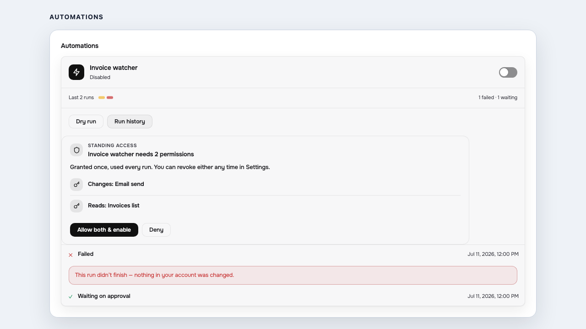

# Final cleanup — the run-history row, and Cadence's last model essay

Two cleanups closing the UI redesign wave. Branch `redesign/final-cleanup` off
`redesign/ui-s1` at `551b52727`.

LAW: spec §16 law 3 (`docs/superpowers/specs/2026-08-02-agentic-ui-redesign-design.md`)
— no raw machine value on an end-user surface — plus the automations design's
consumer-voice run history.

---

## Cleanup 1 — the run-history row printed the wire, not the words

`packages/ui/src/chrome/automations-panel.tsx:559-560`.

The owner-facing run row rendered `{run.status}` and `{run.startedAt}` verbatim:
the `RunStatus` slug (`error`, `pending-approval`) and a raw ISO instant. Both
helpers that turn those into human words were already in the file and already in
use for the dot strip's tooltip one hundred lines above — `RUN_STATUS_LABEL`
(line 19) and `formatAuditTime` (imported, line 8). The fix reads them; nothing
new was invented.

The ISO instant stays in `<time dateTime>`, which is where a machine reads it.

### Proof — real Chromium, shipped component

`packages/ui/e2e/run-history-voice.spec.ts`, over the real harness scenario with
the run list patched at the wire (the same technique the pass-3 spec uses).



`automations-run-history.png` — two runs, both at `2026-07-11T12:00:00.000Z`:

| wire value | what the owner reads |
| --- | --- |
| `"error"` | **Failed** |
| `"pending-approval"` | **Waiting on approval** |
| `"2026-07-11T12:00:00.000Z"` | Jul 11, 2026, 12:00 PM |

Asserted, not just photographed: `.fl-act-lbl` is exactly
`["Failed", "Waiting on approval"]`, the row's rendered text contains neither the
ISO instant nor `pending-approval`, and `<time datetime>` still carries the
instant.

```
Running 2 tests using 1 worker
[1/2] the vocabulary CANNOT catch this — which is why the row's own text is the control
[2/2] a run-history row names its state and its time in the owner's words
  2 passed (1.7s)
```

### Negative control — run live

With `automations-panel.tsx:559-560` reverted to `{run.status}` /
`{run.startedAt}` and nothing else changed, the same spec fails, and the browser
prints the slugs:

```
    -   "Failed",
    -   "Waiting on approval",
    +   "error",
    +   "pending-approval",
      ]
  1 failed
    [chromium] › e2e/run-history-voice.spec.ts:67:1 › a run-history row names its
    state and its time in the owner's words
  1 passed (9.3s)
```

Pass 3's own `pass3/c-automations-failed-run.png` photographed this row BEFORE
this cleanup, so it still shows `error` and the ISO instant. It is left as it
was — it is pass 3's record of pass 3 — and `automations-run-history.png` here is
the current picture.

### Honest limit, asserted rather than hidden

`src/consumer-voice.ts` — the ONE vocabulary the product gates on — does NOT
flag either value: `error` is a real English word, and the ISO instant carries no
id underscore or dotted identifier path. A filter could never have caught this
row, so the control is the row's own text. The spec asserts the vocabulary's
blindness explicitly (and that it still catches `needs_review`, so the audit is
alive rather than broken).

### Test edit, called out loudly

`packages/ui/test/chrome/panels.test.tsx:76` PINNED THE SLUG. Its own commit,
`40df607f0`:

```
OLD: await waitFor(() => expect(screen.getByText("stopped")).toBeTruthy());
NEW: await waitFor(() => expect(screen.getByText("Stopped")).toBeTruthy());
```

`"stopped"` reads acceptably by accident — it is still the machine value, and
`RUN_STATUS_LABEL.stopped` is `"Stopped"`. The same map turns its siblings into
"Failed" and "Waiting on approval", which do not read acceptably at all, so the
assertion moves to the mapped label rather than being left as a licence for the
render site to print slugs.

---

## Cleanup 2 — Cadence's `setDocumentStatus` carried a model essay in a human field

`examples/demo-accounting/openapi.json:189` (→ `.vendo/tools.json:799`).

The description a consent card reads out loud was:

> Advance a document through its lifecycle: 'receive' marks a missing document as
> uploaded (attaching a file name), 'verify' confirms an uploaded document is
> correct, 'reject' returns a wrong upload to missing with a reason the client
> sees. Verify and reject only apply to documents in status received or
> needs_review.

Now:

> Marks one of a client's requested documents as received, verified or rejected.

The guidance moved, word for word, to the `action` property's own description —
where the model actually reads shapes. This is LEAK 1's pattern (`c93cb5009`),
which made the identical move in this same file for `simulateClientUpload`.

**Tidiness, not a leak.** Pass 3's runtime gate (`admissibleDescription` →
`isConsumerSafe`) already DROPS that sentence at the card, because
`needs_review` trips "an id-shaped token". No customer ever saw it. This closes
the other half: the demo stops producing it.

### Layering — `openapi.json`, not `.vendo/overrides.json`

demo-bank's TASK 2 (`19b0859fa`) authored its sentences in
`.vendo/overrides.json` for a specific reason, stated in that commit: its tools
come from the ROUTE SCANNER, which has no channel for a human description, so
`tools.json` is machine-owned end to end and the override layer is the only place
a human may write. Cadence's tools are extracted from a hand-written OpenAPI
document — the source IS the human's authoring channel, and LEAK 1 already
authored here. A second, redundant layer would have been the wrong answer.
`overrides.json` stays `{}`.

### `vendo sync . --no-ai` — the delta is the two strings

```
$ pnpm exec vendo sync . --no-ai      # in examples/demo-accounting
tools: +0 -0 ~0
pins: 0 captured, 0 drifted
catalog.json: 3 discovered, 3 registered
```

`.vendo/tools.json`: the `host_setDocumentStatus` description, the `action` field
description, and the `openapi.json` `srcHash` every tool carries (the same churn
LEAK 1's own commit produced). No tool added, removed or otherwise changed.

### No sibling shares the shape

Every one of Cadence's 13 tool descriptions swept through the shipped predicate
`consumerVoiceViolation` from `packages/ui/src/consumer-voice.ts`:

- BEFORE: 12 pass, 1 DROP — `host_setDocumentStatus`, `an id-shaped token: needs_review`
- AFTER: 13 of 13 pass

So "any sibling with the same shape" resolves to none, by the product's own
predicate rather than by taste. (demo-bank's `tools.json` still shows seven
route-scanner fallbacks to that raw sweep; those are the ones its
`overrides.json` replaces at runtime — TASK 2's layering, not a regression.)

---

## Gate

- `pnpm build --force` — 24/24, 0 cached
- `pnpm typecheck --force` — 43/43, 0 cached
- `pnpm --filter @vendoai/ui test` — 97 files, 857 tests passed
- `pnpm --filter demo-accounting test` — 20 files passed, 2 skipped; 156 passed, 6 skipped
- `pnpm exec playwright test e2e/run-history-voice.spec.ts` (PORT 3225, killed
  after) — 2 passed

The full root test suite was deliberately SKIPPED: an independent checker is
reading the integration worktree concurrently and the machine had to stay usable.

## Not fixed — flagged, out of scope

The row's icon is `run.status === "error" ? "✕" : "✓"`, so the
"Waiting on approval" row above wears a green success tick. Pre-existing, visible
in the screenshot, and not this cleanup's brief — a simplify pass runs after
this.
