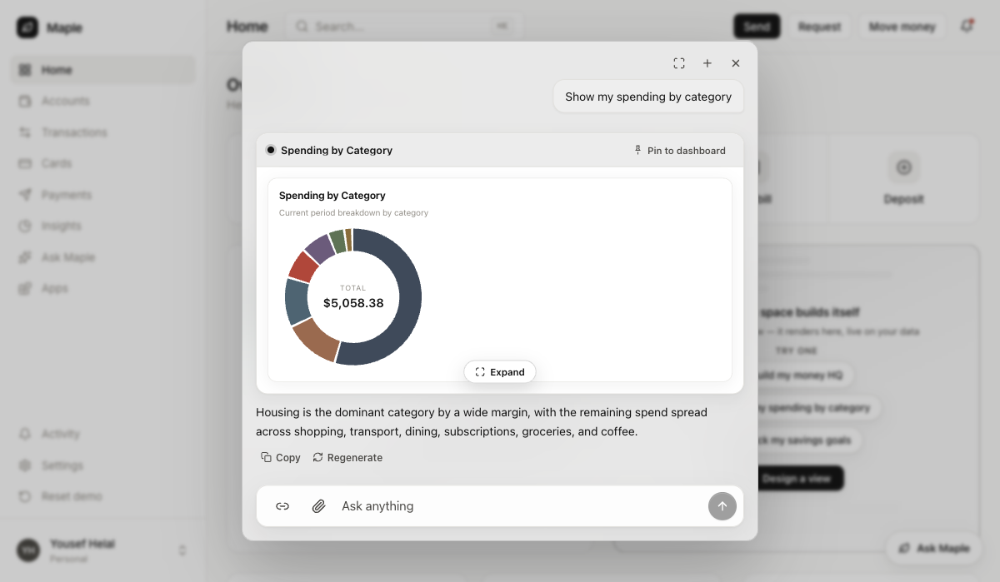

# donut-bind — "Show my spending by category" renders

The live failure (deployed Maple, 2026-07-27): the most obvious prospect
prompt rendered three empty "Building your view…" cards and a text fallback.
Every create failed the same way on attempt 0:

```
[vendo] gen full invalid (1 issue): node "maplespendingdonut-1" prop
"slices" binds /hostGetSpendingInsights: expected an array, the bound field
is object
[vendo] gen pipeline full attempt=1 valid=true
```

The model bound the donut's `slices` array prop to the spending tool's ROOT
object. The route answers the `{ data: [...] }` envelope, so the array is one
hop in. A kind mismatch is not a compile binding error, so structured repair's
closed fix space was empty and the whole app was regenerated instead.

## After — local run, this branch

`MAPLE_STORE=local`, BYO `ANTHROPIC_API_KEY`, `next dev -p 3100`, signed in as
`yousef@maple.com`, prompt typed into the assistant composer verbatim.

```
[vendo] gen paint first-partial at=1.2s
[vendo] gen full complete at=14.2s tokens=21184→100
[vendo] gen pipeline full attempt=0 valid=true ms=12418
[vendo] gen pipeline data-verify applied=false relabels=0 rebinds=0 ms=1260
[vendo] gen create complete app=app_6fe5828a-c4c6-4cad-9e2d-31812286006f total=20.9s
```

Attempt 0 clean — no `expected an array` issue, one full lane, no
regeneration. The persisted document binds the nested path:

```json
{ "id": "maplespendingdonut-1", "source": "host", "component": "MapleSpendingDonut",
  "props": { "size": 240, "slices": { "$path": "/hostGetSpendingInsights/data" } } }
```



## What proves what

- **T2 (this run)** — the recorded output schema plus the tightened catalog
  description make the contract unambiguous, so the model binds `data` first
  try. That is the screenshot and the attempt-0 log above.
- **T1 (offline)** — the generic repair. Reproducing the wrapper bind live is
  not deterministic (the local BYO model, `claude-sonnet-4-6`, bound `data`
  even with the old description restored — a probe run kept for honesty:
  `full attempt=0 valid=true`), so the repair is proven by
  `packages/apps/src/wrapper-envelope-bind.test.ts`, whose fixture reproduces
  the live validator message byte-for-byte and asserts the rebind lands with
  ONE model call — no strict repair round, no second full lane. The ambiguous
  cases (two arrays, no array) are asserted unchanged there too.
- **The contract agrees with the route** —
  `apps/demo-bank/src/vendo/tool-output-schema.test.ts` calls the real route
  handler and checks the recorded `outputSchema` against what it actually
  returns, in both directions (nothing required-but-absent, nothing
  returned-but-undeclared).
