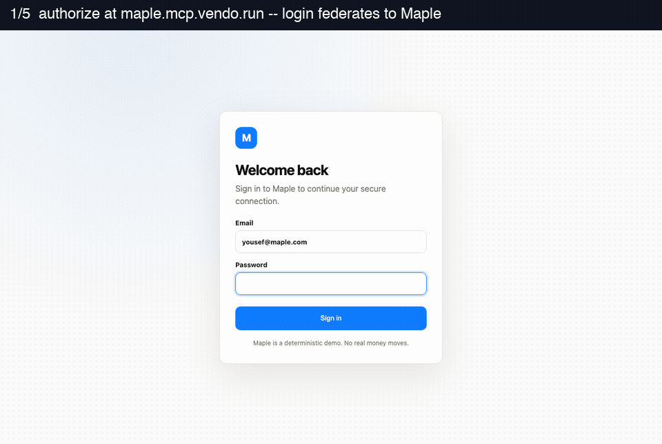

# ENG-286 — broker e2e: one real host through the broker (LOCAL leg)

The full broker dance, run end-to-end on one machine on 2026-07-15: a **real MCP
SDK client** connects to a **local instance of the Vendo hosted MCP broker**
(`vendo-web` `services/broker`, PR #31, run at `runvendo/vendo-web@96c174a`),
which fronts a **real host product — Maple (`apps/demo-bank`)** — as tenant
`maple.mcp.vendo.run`. Every OAuth, federation, consent, tool, approval, and
revocation beat crossed real HTTP between three real processes.



## What was proven (13 beats, `transcript.json`)

| # | Beat | Evidence |
|---|------|----------|
| 1 | Discovery: Maple's RFC 9728 protected-resource metadata names the broker tenant issuer; Maple's own RFC 8414 surface is 404 (remote-AS mode) | `discovery` |
| 2 | RFC 7591 dynamic client registration at the broker | `dcr` |
| 3 | `GET /authorize` at the broker → signed HS256 federation request → Maple `{mount}/federate` → Maple login bounce (browser, `01-login-bounce.png`) | `login-bounce` |
| 4 | Maple session → single-use federation assertion → broker `/federation/callback` → broker consent page for the tenant (`02-broker-consent.png`) | `broker-consent` |
| 5 | Approve → authorization code with exact `state` round-trip to the client's local `redirect_uri` (`03-client-connected.png`) | `authorization-code` |
| 6 | Code + PKCE S256 + RFC 8707 `resource` → ES256 access token + rotating refresh token | `tokens` |
| 7 | Real `@modelcontextprotocol/sdk` client over Streamable HTTP against the broker's `/mcp`, streamed through to Maple's door: `tools/list` returns Maple's 28 guard-bound tools | `tools-list` |
| 8 | Read tool `host_listAccounts` returns seeded Maple data through the whole chain (broker JWT → door remote-AS verify → principal → actAs → Maple API) | `read-tool` |
| 9 | Destructive `host_transferMoney` parks: in-band `isError` naming the approval | `destructive-parks` |
| 10 | The parked approval appears in **Maple's own product UI** (Vendo-tab approvals inbox, `04-approval-card-in-maple.png`) | `approval-visible-in-maple` |
| 11 | Approved in-product (plain approve, no standing grant; `05-approval-resolved.png`) | `approved-in-product` |
| 12 | Identical MCP retry succeeds — the door pins the parked call's ToolCall id, so the one-off approval covers exactly that call | `retry-succeeds` |
| 13 | RFC 7009 revoke at the broker → the same bearer gets 401 at `/mcp` | `revoked` |

## What ran

| Process | Source | Notes |
|---|---|---|
| Broker | `runvendo/vendo-web@96c174a`, `services/broker`, `pnpm dev` (tsx), port 4310 | Postgres 16 in Docker (port 5544), both `supabase/migrations/*.sql` applied plus a stub `public.orgs` row; keys from `pnpm generate-keys` |
| Console stub | `console-stub.mjs`, port 4390 | Answers `POST /api/v1/keys/validate` for one made-up `vnd_…` key (`CONSOLE_URL` points here) |
| Maple | `runvendo/vendo` branch `yousef/eng-286-remote-as-umbrella-seams` (PR #245), `pnpm --filter demo-bank dev`, port 3000 | Store = PGlite dataDir; no model key needed for these beats |
| TLS fronts | `tls-front.mjs` — 127.0.0.1:8444 (SNI `*.mcp.vendo.run`) → broker, 127.0.0.1:8443 → Maple | Throwaway self-signed cert, SANs `*.mcp.vendo.run` + `127.0.0.1` |
| CONNECT proxy | `connect-proxy.mjs`, port 8888 | Lets the Playwright browser reach `https://maple.mcp.vendo.run` (port 443) on loopback; refuses all non-loopback targets |
| Driver | `broker-e2e.mjs` | Node legs remap `*.mcp.vendo.run:443` → the TLS front with a custom undici connector that **trusts the local cert as CA** (verification stays on) |

Everything bound to 127.0.0.1. All secrets (signing key, master key, federation
secret, tenant key) were locally generated throwaways that never left `/tmp`.

## Exact commands

```sh
# 1. Postgres + broker schema (throwaway container)
docker run -d --name eng286-broker-pg -e POSTGRES_PASSWORD=… -e POSTGRES_DB=broker \
  -p 127.0.0.1:5544:5432 postgres:16-alpine
docker exec eng286-broker-pg psql -U postgres -d broker \
  -c "create table if not exists public.orgs (id uuid primary key, name text, slug text);" \
  -c "insert into public.orgs values ('00000000-0000-4000-8000-0000000000aa','Local Test Org','local-test-org');"
# apply services/broker/supabase/migrations/*.sql via psql -f (single transaction each)

# 2. Broker keys + env (services/broker in runvendo/vendo-web)
pnpm generate-keys   # BROKER_SIGNING_KEY + MASTER_KEY (kept local)
# env: DATABASE_URL=postgresql://postgres:…@127.0.0.1:5544/broker
#      CONSOLE_URL=http://127.0.0.1:4390  PORT=4310
#      NODE_EXTRA_CA_CERTS=<local tls.crt>   # broker → Maple upstream is https
node console-stub.mjs & node tls-front.mjs & node connect-proxy.mjs & pnpm dev

# 3. Provision the tenant against the LOCAL broker
curl -X POST http://127.0.0.1:4310/admin/tenants \
  -H "authorization: Bearer vnd_<local test key>" -H "content-type: application/json" \
  -d '{"slug":"maple","product_name":"Maple","upstream_origin":"https://127.0.0.1:8443","upstream_mount":"/api/vendo/mcp"}'
# → returns the federation_secret (once)

# 4. Maple, broker-fronted (runvendo/vendo, PR #245 seams)
NODE_EXTRA_CA_CERTS=<local tls.crt> \
VENDO_BASE_URL=https://127.0.0.1:8443 \
VENDO_MCP_REMOTE_AS_ISSUER=https://maple.mcp.vendo.run \
VENDO_MCP_REMOTE_AS_AUDIENCE=https://maple.mcp.vendo.run/mcp \
VENDO_MCP_REMOTE_AS_JWKS_URI=http://127.0.0.1:4310/.well-known/jwks.json \
VENDO_MCP_FEDERATION_SECRET=<from step 3> \
pnpm --filter demo-bank dev

# 5. The proof
node broker-e2e.mjs   # 13 beats, screenshots, transcript.json
```

## Depends on (code, separate PR)

The seams that make a `createVendo` host broker-frontable landed as **PR #245**
(full gate green): session-only federation in `@vendoai/mcp`, `mcp: { remoteAs,
federation }` plumbing in the umbrella, env-gated broker trust + the approvals
inbox in Maple. Without it, `createVendo({ mcp: true })` hosts cannot be
fronted at all (the umbrella dropped `remoteAs`/`federation`) and Maple's
session-only oauth adapter 404'd the `{mount}/federate` handshake.

## Local-harness notes (not product findings)

- The broker hardcodes issuer `https://{slug}.mcp.vendo.run`, so the local run
  fronts it with a loopback TLS listener + a CONNECT proxy for the browser and
  a host-remapping undici connector for Node. Nothing binds below port 1024,
  nothing leaves loopback.
- Next.js **dev** assets don't hydrate through the second (fronted) origin
  without `allowedDevOrigins` (added, dev-only, in PR #245); even with it, the
  dev-server pages are driven at `http://localhost:3000` for the in-product
  approval beats. A built/deployed Maple has one public origin and none of
  this applies (ENG-267 already proved the door on Railway).
- Chromium under the local proxy drops the fresh Maple session cookie on the
  redirect hop immediately after the login POST; the driver retries the same
  signed federate request once — explicitly supported by the handshake design
  ("bounce and retry the same request").

## Parked for the production leg (Yousef)

- **Deploy**: Railway project/service for `services/broker`, real `DATABASE_URL`
  (console Supabase migrations via the operator runbook in the broker README),
  production `BROKER_SIGNING_KEY`/`MASTER_KEY`, `CONSOLE_URL=https://console.vendo.run`.
- **DNS**: `*.mcp.vendo.run` wildcard CNAME + `_acme-challenge` + TXT records
  per Railway's custom-domain output (Cloudflare nested-wildcard cert rules).
- **Tenant key issuance**: a real `vnd_…` console key to provision the Maple
  tenant against the production broker, and the federation secret installed in
  the deployed Maple.
- **Real-Claude leg**: connecting Claude (or another production MCP client) to
  `https://maple.mcp.vendo.run/mcp` — no Claude session was available for the
  local leg; the client here was the real MCP SDK.
